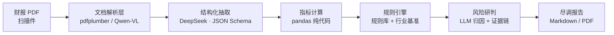

<div align="center">

# 明鉴 · 企业财务尽调与风险研判 Agent

**上传一份标的公司财报，智能体自动完成解析、指标计算、规则匹配与风险研判，输出一份可解释的尽调初筛报告。**

[](LICENSE)
[](#)
[](#)
[](#)

</div>

---

## 目录

- [项目简介](#项目简介)
- [核心价值](#核心价值)
- [功能特性](#功能特性)
- [总体架构](#总体架构)
- [快速开始](#快速开始)
- [真实数据验证](#真实数据验证)
- [项目结构](#项目结构)
- [方案材料](#方案材料)
- [迭代计划](#迭代计划)
- [开源协议](#开源协议)
- [免责声明](#免责声明)

## 项目简介

**明鉴**是面向**投资尽调初筛**场景的 AI 财务尽调 Agent。以公开上市公司财报（PDF）为输入，通过多步编排自动完成「资料理解 → 指标计算 → 规则匹配 → 风险提示 → 报告生成」的任务闭环。

它把资深投资经理的财报尽调经验，沉淀为**可配置规则库 + 可解释推理链**，将「财报初筛」从小时级人工通读，变成**分钟级、标准化、可追溯**的自动化流程——帮投资团队更快筛掉问题标的、聚焦值得深挖的项目。

## 核心价值

| 维度 | 说明 |
|------|------|
| 计算与推理分离 | 财务指标用代码精确计算，LLM 只做归因与表达，避免「算错数」 |
| 可解释风险研判 | 每条风险都携带可追溯证据链（指标 + 阈值 + 实际值），非「黑盒打分」 |
| 可配置规则库 + 行业基准 | 经验规则化、规则开源化，支持按行业、按机构扩展 |
| 双通道资料理解 | 文本 + 视觉，覆盖普通 PDF 与扫描件 |

## 功能特性

- **资料理解**：`pdfplumber` 定位并提取三大报表（资产负债表 / 利润表 / 现金流量表），LLM 抽取为结构化 Schema；
- **指标计算**：纯 Python 计算偿债、盈利、营运、成长、现金流五大类财务指标，数值不交给 LLM；
- **规则匹配**：可配置风控规则引擎（8 大类 13+ 条），含行业基准（房地产 85% / 建筑 80% / 白酒食品 50% / 金融豁免）；
- **风险提示**：命中项带证据引用（指标 + 阈值 + 实际值），LLM 归因生成研判；
- **报告生成**：输出结构化 Markdown 尽调报告，可导出。

## 总体架构



| 层 | 选型 | 说明 |
|----|------|------|
| 编排 | LangGraph（Python） | 开源、表达多步工作流 |
| 主推理模型 | DeepSeek（chat / reasoner） | 云端 API、中文强、成本低 |
| 视觉/表格解析 | Qwen-VL（可选） | 处理扫描件与复杂表格 |
| 指标计算 | Python + pandas | 数值计算不交给 LLM |
| 知识库 | 向量检索（行业基准 / 监管规则） | 规则可插拔、可扩展 |
| Demo UI | Streamlit | 上传文件 → 展示报告 |

## 快速开始

### 1. 安装依赖

```bash
pip install -r requirements.txt
```

### 2. 配置 DeepSeek API Key

复制 `.env.example` 为 `.env`，填入你的 API Key：

```bash
cp .env.example .env
```

`.env` 内容：

```
DEEPSEEK_API_KEY=sk-xxxx
DEEPSEEK_BASE_URL=https://api.deepseek.com
DEEPSEEK_MODEL=deepseek-chat
```

### 3. 命令行运行

```bash
# 跑全部样例（健康 vs 风险）
python main.py

# 只跑风险样本
python main.py risky

# 纯规则模式（不调用 LLM，仅规则 + 指标）
python main.py risky --no-llm

# 从财报 PDF 解析并跑尽调
python main.py --pdf /path/to/annual_report.pdf
```

### 4. Streamlit Demo

```bash
python -m streamlit run app.py
```

浏览器打开后，可选择「使用样例」或「上传财报 PDF」，点击「运行尽调」即可查看风险等级、关键指标、风险清单与研判结论，并可下载 Markdown 报告。

## 真实数据验证

已在两份真实 A 股年报上跑通全流程：

| 标的 | 行业 | 综合风险等级 | 命中关键风险 |
|------|------|-------------|-------------|
| 贵州茅台（2024 年报） | 白酒 | 低风险 | 未命中显著规则 |
| 万科 A（2024 年报） | 房地产 | 高风险 | 经营亏损、利息保障倍数过低、毛利率下滑、营收负增长 |

- **指标准确性**：茅台毛利率 91.9%、净利率 52.3%、ROE 36.9%，与公开数据一致；万科净利润 -487 亿、营收同比 -26.3%，与年报披露吻合。
- **行业基准生效**：万科资产负债率 73.7%，在房地产 85% 参考线内不误报，同时因经营亏损、营收下滑等被正确判为高风险。
- **计算与推理分离**：财务指标由纯 Python 计算，规则引擎支持 `--no-llm` 纯规则模式。

## 项目结构

```
.
├── app.py                    # Streamlit Demo UI
├── main.py                   # 命令行入口
├── diligence/                # 核心模块
│   ├── config.py             # 环境配置加载
│   ├── extract.py            # PDF 解析 + LLM 结构化抽取
│   ├── metrics.py            # 财务指标计算（纯代码）
│   ├── rules.py              # 风控规则引擎 + 风险分级
│   ├── llm.py                # DeepSeek 客户端 + 风险研判
│   ├── report.py             # Markdown 报告生成
│   ├── pipeline.py           # 尽调主流程编排
│   └── sample_data.py        # 内置样例数据
├── scripts/
│   └── gen_test_pdf.py       # 从样例数据生成测试 PDF
├── docs/                     # 方案材料
│   ├── 明鉴_方案.pptx
│   └── 明鉴_方案.pdf
├── 方案书.md                 # 参赛方案书
├── LICENSE                   # Apache-2.0
└── requirements.txt
```

## 方案材料

- 参赛方案书：[方案书.md](方案书.md)
- 方案 PPT：[明鉴_方案.pptx](docs/明鉴_方案.pptx)
- 方案 PDF：[明鉴_方案.pdf](docs/明鉴_方案.pdf)

## 迭代计划

| 阶段 | 目标 | 交付物 |
|------|------|--------|
| 初赛 | 验证场景价值与可行性 | 作品简介、方案 PPT/PDF、可选原型 |
| 复赛 | 完成可运行 Demo 与技术验证 | 更新方案、Demo、运行说明、代码/工程材料 |
| 决赛 | 现场路演与答辩 | 路演 PPT、现场 Demo、最终工程材料 |

## 开源协议

本项目采用 [Apache License 2.0](LICENSE)。

## 免责声明

本工具输出的尽调报告由 AI 辅助生成，仅供研究参考，**不构成投资建议**。本工具定位于「尽调初筛辅助」，最终判断由投资团队完成。
