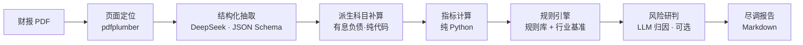

<div align="center">

# 明鉴 · 企业财务尽调与风险研判 Agent

**上传一份标的公司财报，智能体自动完成解析、指标计算、规则匹配与风险研判，输出一份可解释的尽调初筛报告。**

[](LICENSE)
[](#)

</div>

---

## 目录

- [项目简介](#项目简介)
- [核心价值](#核心价值)
- [功能特性](#功能特性)
- [总体架构](#总体架构)
- [快速开始](#快速开始)
- [样例与自测记录](#样例与自测记录)
- [真实年报验证](#真实年报验证)
- [指标口径与已知近似](#指标口径与已知近似)
- [已知限制](#已知限制)
- [AI 使用披露](#ai-使用披露)
- [项目结构](#项目结构)
- [开源协议](#开源协议)
- [免责声明](#免责声明)

## 项目简介

**明鉴**是面向**投资尽调初筛**场景的 AI 财务尽调 Agent。以公开上市公司财报（PDF）为输入，自动完成「资料理解 → 指标计算 → 规则匹配 → 风险提示 → 报告生成」的任务闭环。

它把财报尽调经验沉淀为**规则库 + 可解释推理链**，把「财报初筛」从小时级人工通读，变成**分钟级、标准化、可追溯**的自动化流程——帮投资团队更快筛掉问题标的、聚焦值得深挖的项目。

## 核心价值

| 维度 | 说明 |
|------|------|
| 计算与推理分离 | 财务指标用代码精确计算，LLM 只做归因与表达，避免「算错数」 |
| 可解释风险研判 | 每条风险都携带可追溯证据链（指标 + 阈值 + 实际值），非「黑盒打分」 |
| 行业基准阈值 | 资产负债率参考线按行业分档（地产 85% / 建筑 80% / 酒类食品饮料 50% / 金融豁免） |
| 缺失即未知 | 取不到的科目一律记为「—」并跳过相关规则，绝不按 0 计算 |
| 数据自检 | 抽取结果先过会计恒等式与取值区间校验，矛盾即告警，不把错误数据当成结论 |
| 双通道抽取 | 大模型抽取之外提供**规则抽取兜底**：不调用模型、离线也能把年报解析成结构化数据，两者互为对照 |
| 可离线运行 | 纯规则模式不调用任何模型，也不需要 API Key |

## 功能特性

- **资料理解**：`pdfplumber` 定位合并三大报表所在页区间，DeepSeek 按 JSON Schema 抽取为结构化数据；
- **指标计算**：纯 Python 计算偿债、盈利、营运、成长、现金流五大类共 20 项指标，数值不交给 LLM；
- **规则匹配**：风控规则引擎，8 大类 19 条判定分支（偿债 / 现金流 / 收入 / 盈利 / 成长 / 资产 / 粉饰 / 合规）；
- **风险提示**：命中项带证据引用（指标 + 阈值 + 实际值），可选用 LLM 生成归因叙述；
- **资料理解**：`pdfplumber` 定位合并三大报表所在页区间，DeepSeek 按 JSON Schema 抽取为结构化数据；另提供 `parse_lines.py` 规则抽取兜底（不调模型，可离线）；
- **数据自检**：对抽取结果做自洽性体检——会计恒等式（总资产 = 总负债 + 净资产）、取值区间（资产负债率 ∈ [0,1]、毛利率 ≤ 100%）、结构关系（净利率不应高于毛利率）。发现「亏损被读成盈利」这类沉默错误时，报告与界面会显式告警；
- **来源可追溯**：报告标注数据来自哪份年报、共多少页、自动定位到哪几页、用了哪个模型；`--explain` 可单独输出定位诊断（选中页与候选页得分），便于评审核对；
- **报告生成**：输出结构化 Markdown 尽调报告，可下载。

## 总体架构


```mermaid
flowchart LR
    A[财报 PDF] --> B[页面定位<br/>pdfplumber]
    B --> C[结构化抽取<br/>DeepSeek · JSON Schema]
    C --> D[派生科目补算<br/>有息负债·纯代码]
    D --> E[指标计算<br/>纯 Python]
    E --> F[规则引擎<br/>规则库 + 行业基准]
    F --> G[风险研判<br/>LLM 归因 · 可选]
    G --> H[尽调报告<br/>Markdown]
```

| 层 | 选型 | 说明 |
|----|------|------|
| 编排 | 纯 Python 顺序调用（`diligence/pipeline.py`） | 流程线性且短，未引入工作流框架 |
| 主推理模型 | DeepSeek（`deepseek-chat`，可切 `deepseek-reasoner`） | 仅用于结构化抽取与归因叙述 |
| 文档解析 | pdfplumber | 文本型 PDF；扫描件需先自行 OCR（见「已知限制」） |
| 指标计算 | Python（标准库，无第三方数值依赖） | 数值计算不交给 LLM |
| Demo UI | Streamlit | 选择样例或上传 PDF → 展示报告 |

## 快速开始

### 1. 安装依赖

```bash
pip install -r requirements.txt
```

> 只跑纯规则模式（`--no-llm`）时，实际只需要标准库；`python-dotenv`、`openai` 均为可选。

### 2. 配置 DeepSeek API Key（仅 LLM 相关功能需要）

```bash
cp .env.example .env
```

`.env` 内容：

```
DEEPSEEK_API_KEY=sk-xxxx
DEEPSEEK_BASE_URL=https://api.deepseek.com
DEEPSEEK_MODEL=deepseek-chat
```

未配置 API Key 时，程序自动降级为「规则引擎 + 指标」模式，不会报错。

### 3. 命令行运行

```bash
# 跑全部样例（健康 vs 风险）
python main.py

# 只跑风险样本
python main.py risky

# 纯规则模式（不调用 LLM，仅规则 + 指标）
python main.py risky --no-llm

# 从财报 PDF 解析并跑尽调
python main.py --pdf /path/to/annual_report.pdf

# 只做页面定位诊断（不需要 API Key，便于核对「数据是从哪几页来的」）
python main.py --pdf /path/to/annual_report.pdf --explain

# 输出报告到指定目录
python main.py --no-llm --out out
```

### 4. Streamlit Demo

```bash
python -m streamlit run app.py
```

浏览器打开后，可选择「使用样例」或「上传财报 PDF」，点击「运行尽调」即可查看风险等级、关键指标、风险清单与研判结论，并可下载 Markdown 报告。

界面顶部为风险等级徽标与四张核心指标卡（含同比），报告分为「关键财务指标 / 风险清单 / 研判与追溯」三个页签；侧栏顶部的 **「🌙 深色模式」开关**可一键切换深浅色（整个应用一起换肤，自定义样式全部基于 Streamlit 主题变量，两套主题共用一套样式）。

侧栏的 **「⚙️ 模型配置（可选）」** 可在界面内临时填 API Key（仅存于会话内存，不落盘）。**不填也能跑完整流程**：真实年报走规则解析、研判走规则汇总，界面会标明当前为「纯规则模式」。

数据源支持三种：**内置样例**（零配置）、**输入股票代码**（自动获取最新年度报告）、**上传财报 PDF**（不依赖外部接口）。按代码取数走东方财富公告接口，失败会明确报错并提示改用上传路径。

### 5. 离线自测

```bash
python tests/test_offline.py
```

不依赖任何第三方库与网络，覆盖指标口径、缺失科目处理、规则命中、风险分级、数据自洽性校验（含跨路径倍率）、报表页面定位（含定位诊断）、规则抽取（单位换算/括号负数/子串误匹配/符号归一/审计意见防误判）、抽取自校正智能体与抽取提示词约束（共 52 项）。

## 样例与自测记录

仓库内置两个样例（`diligence/sample_data.py`），无需 API Key 即可跑通完整闭环：

| 样例 | 行业 | 综合风险等级 | 命中规则 |
|------|------|-------------|---------|
| 稳健科技股份有限公司（`healthy`） | 制造业 | 低风险 | 0 条 |
| 疑云制造股份有限公司（`risky`） | 制造业 | 高风险 | 8 条（5 高 + 3 中） |

复现命令：`python main.py --no-llm`。

> 说明：本仓库**未随附**真实年报 PDF（`data/*.pdf` 已在 `.gitignore` 中排除），因此任何基于真实年报的验证结论都需使用者自行复现。本项目不在仓库中声明无法被复现的验证结果。

## 真实年报验证

页面定位是抽取链路的第一环，可以用真实年报独立验证（需 pdfplumber）：

```bash
python tests/test_pdf_locate_real.py /path/to/annual_report.pdf
```

判据是独立于被测算法的：报表页 = 页首出现「独立成行的报表标题」（允许「合并 / 合并及公司 / 本行 / 母公司」前缀与「（续）」后缀）。脚本检查定位区间是否覆盖三类报表的标题页。

**实测记录（2026-10-04）**

| 年报 | 页数 | 算法定位区间 | 结果 |
|------|------|-------------|------|
| 万科企业股份有限公司 2024 年（深交所） | 327 | 141–162 | ✓ 资产负债表（151–154）、利润表（155–157）、现金流量表（158–161）全覆盖 |
| 中国工商银行股份有限公司 2024 年（上交所/巨潮） | 410 | 195–219 | ✓ 资产负债表（206–207）、利润表（208–209）、现金流量表（214–215）全覆盖 |

### 这两次验证各修掉了一个真实缺陷

**万科年报**暴露了抽取陷阱（已写入提示词）：表内负数用**圆括号**表示 `(48,703,934,402.33)`，漏读会把亏损算成盈利；亏损公司的行名写作「四、净 (亏损) / 利润」，**「净利润」这一连续字符串在原文中并不存在**。

**工商银行年报**暴露了定位算法的严重缺陷——早期实现「取第一个含关键词的页」，而银行年报里：

1. **「合并现金流量表」这个名字根本不存在**，银行叫「现金流量表」，且首次出现在目录页；
2. **「合并资产负债表」首次出现在第 196 页的审计报告正文里**（"我们审计了……包括……合并及公司资产负债表……"）；
3. 两个坐标一前一后，算出的区间是 `(195, 44)` —— **起止颠倒、切片为空**，抽取到空文本却**不报任何错**。

现在改为按「像不像一张报表」打分选页：标题独立成行（+100）、金额密集（按个数累计）、目录页（−80）、审计报告正文（−60）；并且**任何情况下都保证 `start <= end`**，认不出报表就退回全文。相关逻辑抽到纯标准库模块 `diligence/locate.py`，因此可以写零依赖回归测试。

> 局限说明：该验证覆盖的是「页面定位 + 文本可得性」，不包含大模型抽取结果本身（抽取需要 API Key，结果随模型版本浮动，故不在仓库中断言）。

### 数据自检：用万科真实数据演示

`diligence/validate.py` 会对抽取结果做纯算术语义的自洽性体检。以万科 2024 年报的真实数字为例（单位：万元）：

| 场景 | 净利润 | 校验结果 |
|------|--------|---------|
| A. 符号正确（原文 `(48,703,934,402.33)` 元） | −4,870,393.44 | **0 条告警**（无误报） |
| B. 模拟模型漏读括号，读成 `+4,870,393.44` | +4,870,393.44 | **1 条告警**：净利率 14.2% > 毛利率 10.2%，提示核对净利润符号 |

也就是说：即便大模型把亏损读成盈利，系统也不会默默把这个错误数据当成结论——它会先报警。

## 指标口径与已知近似

| 指标 | 口径 | 说明 |
|------|------|------|
| 资产负债率 | 总负债 / 总资产 | 与行业参考线比较，金融类豁免 |
| 流动比率 / 速动比率 | 流动资产 / 流动负债；（流动资产 − 存货）/ 流动负债 | 分子科目缺失即返回「—」 |
| 毛利率 | （营业收入 − 营业成本）/ 营业收入 | 任一科目缺失即「—」，不会退化成 100% |
| 净利率 / ROE / ROA | 净利润 / 营业收入、净资产、总资产 | 使用全口径净利润与净资产（含少数股东权益） |
| 应收账款周转率 / 存货周转率 | 营业收入（营业成本）/ 应收、存货 | **有上期数据时用期初期末平均余额**，否则退化为期末余额 |
| 净现比 | 经营活动现金流净额 / 净利润 | 净利润为负时不参与规则判定 |
| 利息保障倍数 | （净利润 + 财务费用）/ 财务费用 | 近似口径：未加回所得税，且财务费用为净额（含利息收入、汇兑损益） |
| 有息负债 | 短期借款 + 长期借款 + 一年内到期的非流动负债 + 应付债券 | 由代码计算，不采用模型的算术结果 |
| 营收/净利润增长率 | 本期与上期之差 / 上期 | 任一期缺失即「—」 |

## 已知限制

- **仅支持文本型 PDF**：扫描件无法提取文本，需先经 OCR 处理；当前版本会在抽取前给出空文本，不会自动 OCR；
- **报告期假设为两期**：抽取提示词要求模型输出本期与上期，规则中的同比判断依赖这两期数据；
- **单次抽取**：整段报表文本一次性送入模型，未做分块与长度保护，超长年报可能触及上下文上限；
- **规则阈值为代码常量**：扩展规则需修改 `diligence/rules.py`（阈值集中在该文件顶部区域，便于审阅）；
- **非标准审计意见判定**：抽取提示词已显式排除「关键审计事项」「持续经营重大不确定性段落」被误读为审计意见类型，但最终仍取决于模型输出。

## AI 使用披露

- **运行期模型**：DeepSeek（默认 `deepseek-chat`），仅用于两处——「财报文本 → 结构化 JSON 抽取」与「基于已命中规则生成风险归因叙述」。
- **不涉及模型的部分**：全部财务指标计算、风险规则判定、风险分级、报告渲染均为确定性代码。
- **开发期辅助**：本项目开发过程中使用了 AI 编程助手参与代码编写，人工负责需求定义、指标口径与规则阈值设定、以及结果复核。
- **AI 生成代码占比**：【待填：AI 生成代码占比】

## 项目结构

```
.
├── app.py                    # Streamlit Demo UI
├── main.py                   # 命令行入口
├── diligence/                # 核心模块
│   ├── config.py             # 环境配置加载
│   ├── extract.py            # PDF 解析 + LLM 结构化抽取
│   ├── agent.py              # 抽取自校正智能体（诊断成因→选择补救动作→重试）
│   ├── parse_lines.py        # 规则抽取兜底（不调模型，离线可用）
│   ├── normalize.py          # 字段补全与派生科目（两条抽取路径共用）
│   ├── locate.py             # 报表页面定位（纯标准库，可零依赖测试）
│   ├── metrics.py            # 财务指标计算（纯代码）
│   ├── validate.py           # 数据自洽性校验（恒等式 / 区间 / 符号）
│   ├── rules.py              # 风控规则引擎 + 风险分级
│   ├── llm.py                # DeepSeek 客户端 + 风险研判
│   ├── report.py             # Markdown 报告生成
│   ├── pipeline.py           # 尽调主流程编排
│   └── sample_data.py        # 内置样例数据
├── tests/
│   ├── test_offline.py       # 离线自测（标准库，无网络）
│   └── test_pdf_locate_real.py  # 真实年报页面定位验证（需 pdfplumber）
├── scripts/
│   └── gen_test_pdf.py       # 从样例数据生成测试 PDF
├── LICENSE                   # Apache-2.0
└── requirements.txt
```

## 开源协议

本项目采用 [Apache License 2.0](LICENSE)。

## 免责声明

本工具输出的尽调报告仅供研究参考，**不构成投资建议**。本工具定位于「尽调初筛辅助」，最终判断由投资团队完成。
